# Hi, I'm Isra Anwar

**Commercial Growth Strategist | Executive Leadership Experience | Branding & Marketing | SEO, AEO & GEO | Web Development & AI Integration | 13+ Years**

I am a Commercial Growth Strategist with 13+ years of experience across executive leadership, branding, marketing, search strategy, web development, and AI integration. I work at the intersection of commercial direction and digital execution—turning business goals into stronger brands, discoverable digital experiences, and measurable growth initiatives.

My approach combines strategic leadership with practical delivery: positioning a brand clearly, improving its visibility across search environments, and using technology and AI workflows where they create real business value.

## Expertise

- **Commercial Growth & Executive Leadership** — aligning business priorities, brand direction, and delivery.
- **Branding & Marketing** — shaping clear positioning, messaging, and marketing initiatives.
- **SEO, AEO & GEO** — improving visibility across traditional search, answer engines, and generative search environments.
- **Web Development & AI Integration** — building digital experiences and applying AI workflows where they support the commercial objective.
- **Analytics, Measurement & Media** — connecting performance signals with informed marketing and advertising decisions.

## Selected GitHub Work

- [TADCO.co.id](https://github.com/israanwar/TADCO.co.id) — Website development portfolio repository.
- [Okkax.com](https://github.com/israanwar/okkax.com) — Integrated event ecosystem platform for organisers, talent, venues, vendors, sponsors, ticketing, payments, and operations.
- [OkkaLabs](https://github.com/israanwar/OkkaLabs) — Okkammerce project repository.
- [Okkarhys.com](https://github.com/israanwar/okkarhys.com) — Personal website and portfolio repository.
- [MetodePenelitian.com](https://github.com/israanwar/MetodePenelitian.com) — Research-methods website repository.

## Certifications & Credentials

### AI & Developer Tools

- [Claude 101](https://verify.skilljar.com/c/nuevewitxf89)
- [Claude Code 101](https://verify.skilljar.com/c/fhtkrxhzqhxc)
- [Claude Cowork](https://academy.claude.com/verify/031c71a72121835abc8b66d1ba1c6c14)
- [AI Capabilities and Limitations](https://academy.claude.com/verify/9f76d33420da71607a1dff2bbc9c3183)
- [Building with the Claude API](https://academy.claude.com/verify/737ef965805e087af65b72c28b57b8ab)

### SEO, Search & Analytics

- [Google Analytics](https://skillshop.credential.net/29adf04b-326a-4d42-ac16-765f7ee7a0bb#acc.JmcydX6U)
- [Certified in Ahrefs Marketing Platform](https://ahrefs.com/academy/certificate/97dcdd8085c04f8aa6e45cf7767bb6b6)
- [Semrush AI Search Operating System](https://static.semrush.com/academy/certificates/2325cb8d30/isra-anwar_37.pdf)
- [AI Visibility Essentials with Semrush](https://static.semrush.com/academy/certificates/e26bbacddc/isra-anwar_25.pdf)
- [Technical SEO and AI Search Essentials with Semrush](https://static.semrush.com/academy/certificates/1ed4632abf/isra-anwar_25.pdf)
- [LinkedIn Marketing Measurement Certification](https://training.marketing.linkedin.com/verify/yffmqqh862i5)

### Advertising, Content & Growth

- [Apple Ads Certified](https://certification-ads.apple.com/certificate/EpppzS2EvG)
- [Spotify Advertising Fundamentals Certification](https://advertisingacademy.byspotify.com/student/award/7S5tCgaHTZBdpDHAo1Rh9eWg)
- [Spotify Advertising Strategy & Planning Certification](https://advertisingacademy.byspotify.com/student/award/HbjLmcPaH3oqpDMmBFYag7Rz)
- [Spotify Advertising Media Buying](https://advertisingacademy.byspotify.com/student/award/5fT4p7ZwBd2Ncg6zqvJ54umm)
- [LinkedIn Content and Creative Design Certification](https://training.marketing.linkedin.com/verify/xu4q9q7ivaya)
- [LinkedIn Marketing Strategy Certification](https://training.marketing.linkedin.com/verify/vr83zspwu2fk)
- [Amazon Ads Programmatic Solutions Advanced Certification](https://advertising.amazon.com/academy/certificates/b09f2050-bbcd-461c-8a7b-c9a8cc21a385)
- [Grow Your Monetization with Google Ad Manager](https://skillshop.credential.net/b6fbba7a-31c6-48a9-9a5d-192a4bcae472#acc.QBfDIdjt)
- [The Brand Builder — Amazon Ads](https://advertising.amazon.com/academy/certificates/d8407a9b-68c9-4af4-a9b7-ab5bca92e782)
- [The Performance Expert — Amazon Ads](https://advertising.amazon.com/academy/certificates/3899eabd-213f-4862-a87a-8f9b670fc2c1)

### Meta Blueprint & IBM SkillsBuild

Click a certificate to view it.

Opportunity Score: Experimentally Proven Recommendations to Help Improve Your Campaign Performance — Meta Blueprint

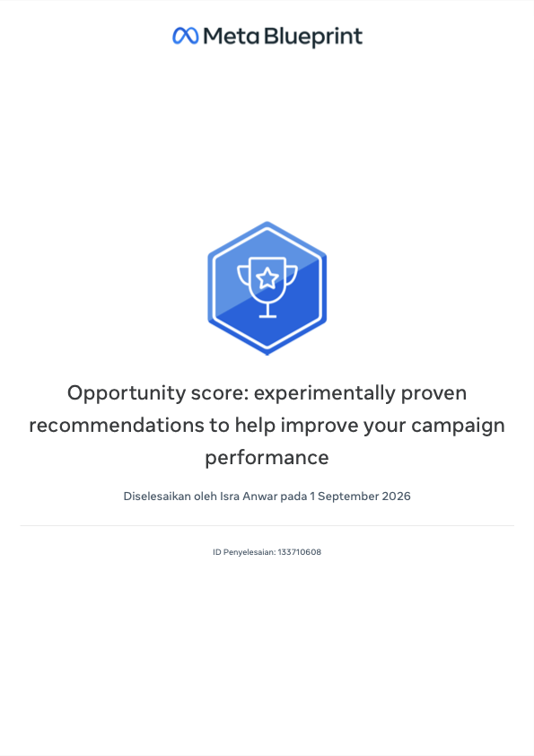

Meta Advertising Standards and Brand Safety — Meta Blueprint

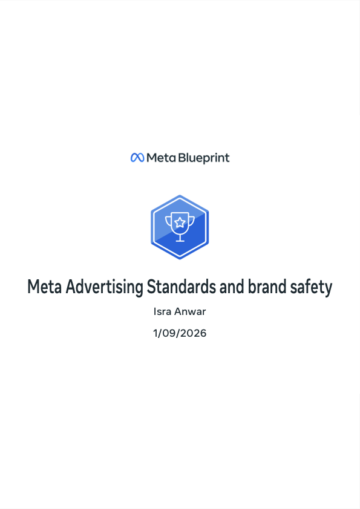

Data Privacy and Policies at Meta — Meta Blueprint

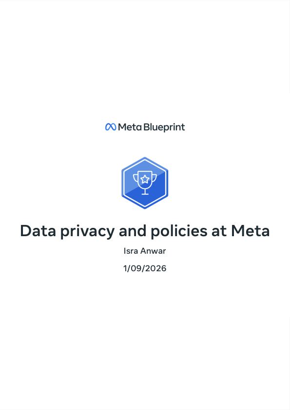

Advertising Solutions and AI — Meta Blueprint

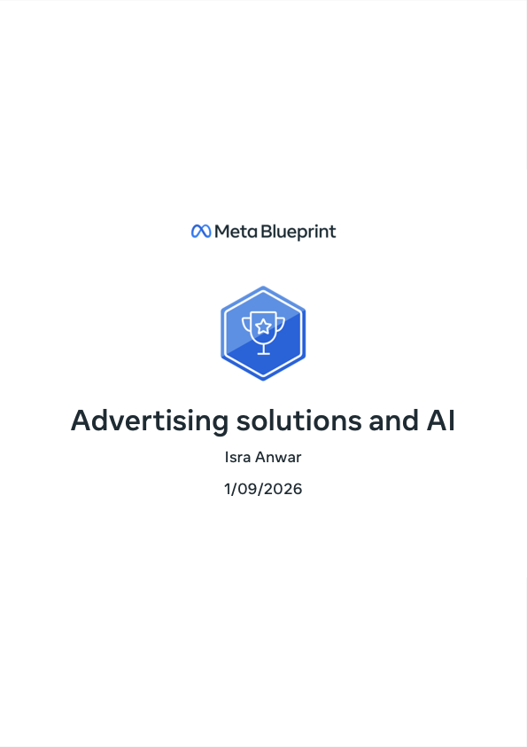

Campaign Evaluation and Measurement Strategies — Meta Blueprint

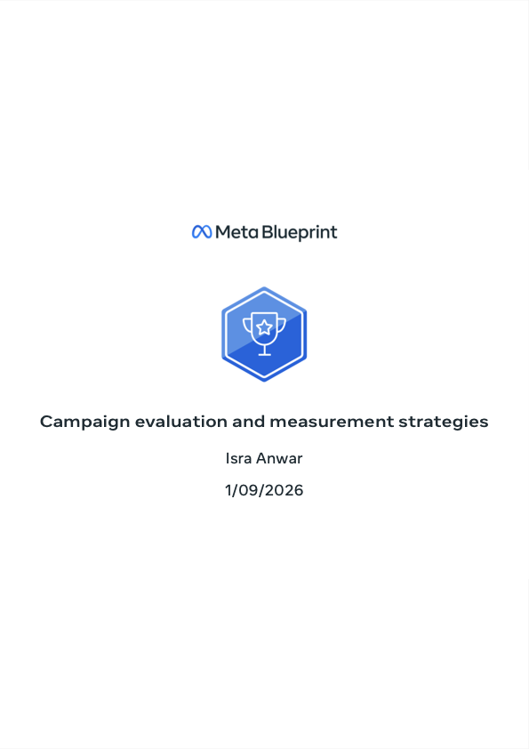

Business Management Tools and Ads Resources — Meta Blueprint

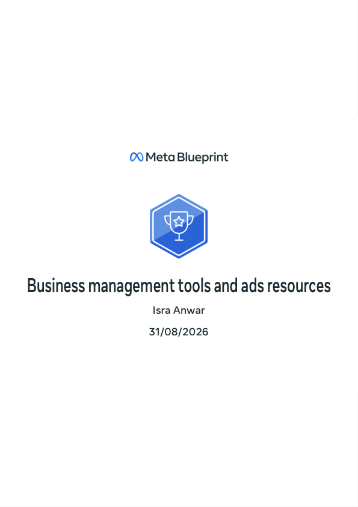

Advertising Solutions Across the Marketing Funnel — Meta Blueprint

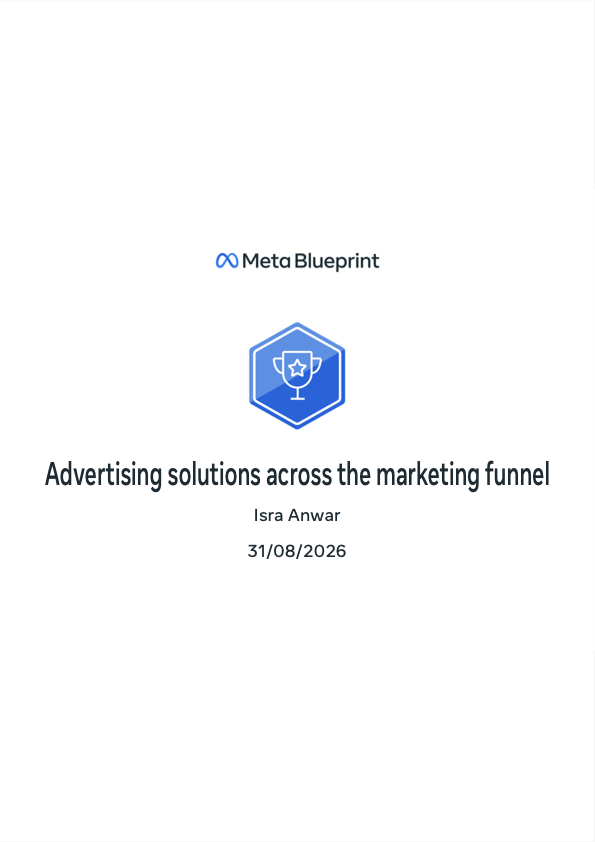

Design an AI-Supported Marketing Campaign — IBM SkillsBuild

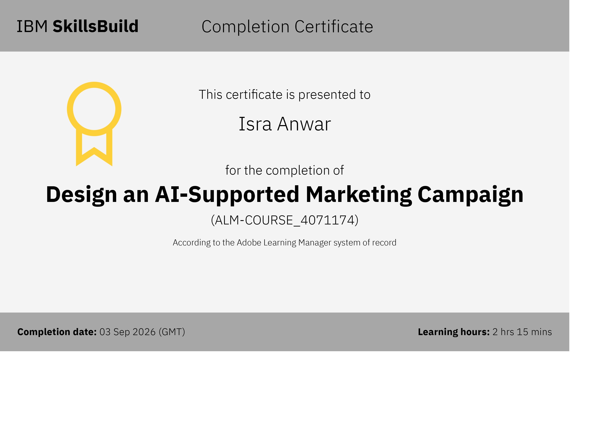

### Earlier Certificates

Implementasi Data Science dalam Sepak Bola — Shift Talks (Shift Academy x Ruang Taktik), 2022

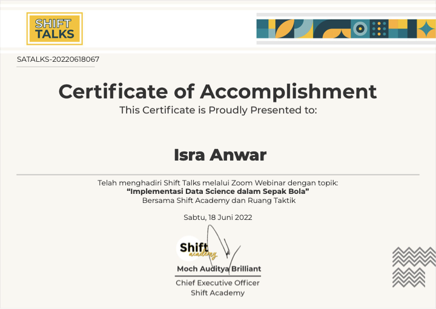

Cara Mudah Membuat Situs untuk Bisnis Anda — Google x Gapura Digital, 2019

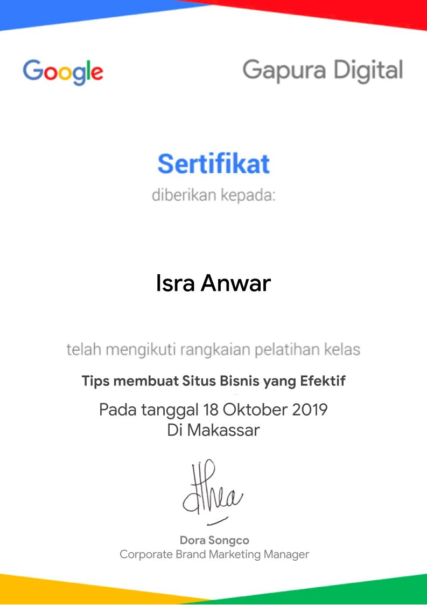

Tips Membuat Situs Bisnis yang Efektif — Google x Gapura Digital, 2019

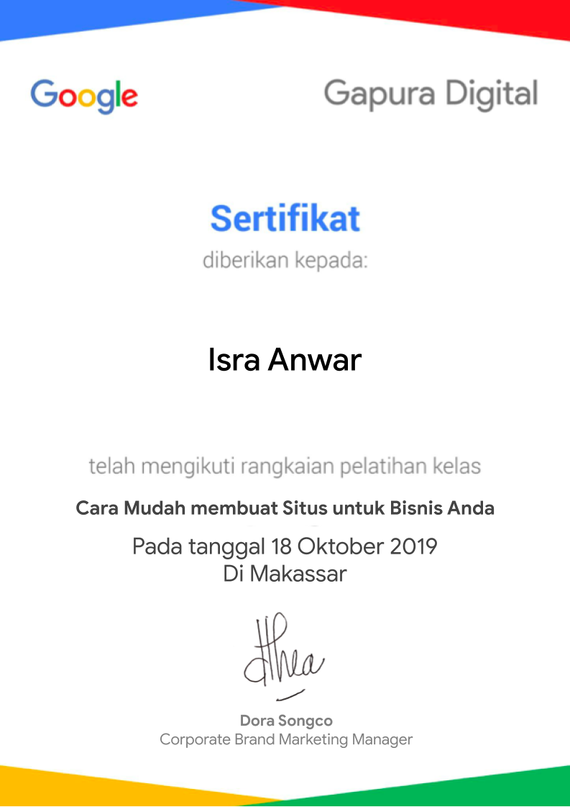

## Continuous Development

I actively develop my knowledge of AI capabilities, AI APIs, AI Search, technical SEO, marketing measurement, and digital media through practical portfolio work and verified professional learning.

## Let's Connect

- [GitHub](https://github.com/israanwar)
- [LinkedIn](https://www.linkedin.com/in/israanwarr/)

Open to meaningful collaboration, strategic conversations, and digital work built with a clear commercial purpose.
